<!-- ─────────────────────────  HEADER  ───────────────────────── -->

  

  

  
  &nbsp;
  

  <em><b>Data Scientist &amp; AI Engineer</b> from <b>NIT Jaipur</b>. I build software — 
  LLM agent systems, quantitative infrastructure, and the production plumbing that holds them up.</em>

 

<!-- ─────────────────────  CURRENTLY BUILDING  ───────────────────── -->

# AlphaSwarm

### *Your AI quant team, in a browser tab.*

> A **multi-tenant SaaS platform** where you describe a trading strategy in plain English — or set a goal like *"retire by 50"* — and an LLM agent writes the Python, runs it inside a hardened sandbox, backtests it against institutional-grade slippage and market-impact modelling, and trades it through **your own broker**.
>
> Built as a pro trading terminal, a wealth-management copilot, and a GitHub-style commons of forkable strategies — with zero infrastructure to run and no Bloomberg subscription.
>
> **It never touches your money.** Funds stay in your own Zerodha / Upstox / Angel One / Alpaca account. It's software that sends orders on your behalf — not a broker, not a fund. That is the entire trust model.

```mermaid
flowchart LR
    A["🗣️ Plain English<br/>'Buy RELIANCE when<br/>RSI(14) drops below 30'"] --> B["🤖 LLM Strategy Compiler<br/><i>Microsoft Agent Framework</i>"]
    B --> C["🔒 Hardened Sandbox<br/><i>RestrictedPython</i>"]
    C --> D["📊 Backtester<br/><i>slippage + market impact</i>"]
    D --> E["🛡️ Risk Engine<br/><i>verify_order_intent()</i>"]
    E --> F["🏦 Your Own Broker<br/><i>Zerodha · Upstox<br/>Angel One · Alpaca</i>"]

    style A fill:#1F8ACB,stroke:#0F2027,color:#fff
    style B fill:#5E5CE6,stroke:#0F2027,color:#fff
    style C fill:#DC382D,stroke:#0F2027,color:#fff
    style D fill:#009688,stroke:#0F2027,color:#fff
    style E fill:#FF6F00,stroke:#0F2027,color:#fff
    style F fill:#37814A,stroke:#0F2027,color:#fff
```

 

<table>
<tr>
<td width="50%" valign="top">

#### 🧠 The AI Layer
- **LLM strategy compiler** — plain English becomes validated, executable Python
- **Microsoft Agent Framework** with a ReAct loop and a sandbox-validate tool
- **Bring-your-own-key** — your LLM provider, your key, your cost
- **AI investment advisor** with RAG over your own portfolio
- **Goal Wizard** — *"₹50L in 20 years"* becomes a real SIP portfolio

</td>
<td width="50%" valign="top">

#### 🔒 The Trust Layer
- **Hardened sandbox** — str-subclass guards, format denylist, SIGALRM exec timeouts
- **Risk is sacred** — `verify_order_intent()` runs before *every* broker call, no bypasses
- **Daily notional caps** and market-hours gating
- **HKDF envelope encryption** for broker credentials — ~21,000× faster than the PBKDF2 it replaced
- **Multi-tenant isolation** — `tenant_id` enforced on every query

</td>
</tr>
<tr>
<td width="50%" valign="top">

#### 📈 The Quant Layer
- **Prop-grade backtester** — models slippage *and* market impact, not fantasy fills
- **Out-of-sample honesty scoring** — strategies can't lie about their own results
- **Monte Carlo wealth forecaster** (GBM) across a unified multi-broker portfolio
- **Multi-broker CAS ingestion** — one view of everything you own
- **pandas-ta indicators** — RSI, MACD, Bollinger, ATR, EMA, VWAP

</td>
<td width="50%" valign="top">

#### 🌐 The Product Layer
- **Bloomberg-style terminal** — candles, overlays, news, AI forecasts, live P&L over WebSockets
- **Strategy Commons** — GitHub-style fork graphs and immutable pinned versions
- **Swarm copy-trading** — a leaderboard of forkable, honestly-scored strategies
- **Creator monetization** — 1% Swarm Tax, split 50/50
- **SIPs** you can pause, resume, top up, and rebalance

</td>
</tr>
</table>

<b>Under the hood</b> 

<!-- DEMO RECORDING: drop the GIF/MP4 in here when it's ready, e.g.

  

-->

 

<!-- ─────────────────────────  SKILLS  ───────────────────────── -->

## 🛠️ What I Work With

<table>
<tr>
<td valign="top" width="33%" align="center">

**AI / Gen AI**

 
 
 
 
 

</td>
<td valign="top" width="33%" align="center">

**Data Science**

 
 
 
 
 

</td>
<td valign="top" width="33%" align="center">

**Systems & Infra**

 
 
 
 
 

</td>
</tr>
</table>

<b>Also fluent in</b> 

 

<!-- GitHub stats cards intentionally omitted: the public github-readme-stats
     instance is rate-limited and was serving 503s, which renders as a broken
     image on the profile. Re-add if you self-host it. -->

<!-- ─────────────────────  COMPETITIVE PROGRAMMING  ───────────────────── -->

## ⚔️ Competitive Programming

&nbsp;

 

<!-- ─────────────────────  BEYOND THE KEYBOARD  ───────────────────── -->

## 🎮 Beyond the Keyboard

<b>🎯 FPS gaming</b> — strategy, teamwork, and split-second decisions, which map to debugging better than they should. 
<b>🎾 Tennis</b> — played as a hobby.

 

  <em>"I love cracking tough problems — whether it's a puzzle, a program, or a process."</em>

  

